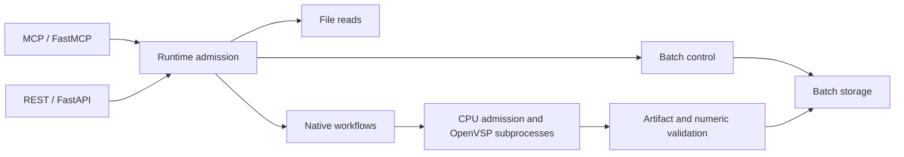

# 0.8.0 architecture and compatibility

This release retains the official MCP Python SDK 1.x/FastMCP adapter and the 16
existing tools. Their input schemas and typed output schemas retain the 0.6/0.7
contract. Existing dictionary outputs acquire additional provenance, timings and
unavailable-ratio metadata. No SDK 2.x migration, persistent OpenVSP interpreter,
geometry cache, or additional tool catalog is introduced.

## Shared implementation

MCP and REST call the same domain operations. `runtime.py` owns admission and
cancellation; `native.py` owns executable identity and audited capabilities;
`numeric.py` owns finite-result policy; `storage.py` owns batch serialization.
The adapters remain small. These shared modules remove duplicated policy inside
this package without introducing a separate general-purpose MCP framework.

Native requests use two AnyIO worker permits, file inspection/saved-result reads
four, and batch lifecycle operations four. Each group has an independent AnyIO
limiter, so pending native requests do not occupy the default thread pool while
waiting for a semaphore. Queued cancellation does not wait for a nonexistent
worker. In-flight cancellation retains the process-group cleanup path. Batch
workers still use the shared weighted CPU allocator. These are per-process
limits, not machine-wide limits or an assurance that every control request is
instantaneous under arbitrary control traffic.

## Audited upstream changes

The source comparison is OpenVSP 3.51.3
(`51bdec01d9a50fa4bdbc960b0def21dcd6330f72`) to 3.53.1
(`10b2c5708dd0cb7ecf8bc009c714fa2e5982b6a9`). The VSPAERO AnalysisMgr input
interface used by this wrapper remains applicable. Important upstream changes:

- The [AngelScript string-return binding fix](https://github.com/OpenVSP/OpenVSP/commit/901a9b1c8b57025db62c9c22545aee7b593f2af1)
  permits `GetAnalysisInputDoc` on 3.53.0/3.53.1. The generated script guards
  the actual call with an explicit version allowlist. Unknown future versions
  remain conservative until audited. 3.53.0 is source-audited; native workflow
  validation in this release covers 3.53.1.
- The [local Reynolds-number correction](https://github.com/OpenVSP/OpenVSP/commit/b6e02c8b72b296d209c20683de1dd505d434ccb4)
  changes the lifting-surface expression from `ReCref * Velocity * Chord / Cref`
  to `ReCref * Velocity * Chord / (Vinf * Cref)`. Geometry/skinning code also
  changed. Old coefficient baselines cannot be applied indiscriminately to the
  new binary. Both report VSPAERO 7.2.2, so version strings alone are insufficient
  provenance. The coefficient difference has not been attributed exclusively to
  any one upstream change by a controlled old/new binary experiment.
- Upstream also fixed underscore handling in control names. This wrapper's
  supported workflow remains steady analysis; this release does not certify
  control derivatives or unsteady analysis.

Health reports readiness and the tested version matrix separately. Native
executable SHA-256 identities are included in single-run manifests and batch
specifications. Hashes are cached by resolved path/device/inode/size/mtime/ctime,
and checked for changes during hashing. Explicit resume clears that cache and
performs content verification again. Source snapshots, successful responses and
artifacts retain their content checks; those are not replaced by stat-only tests.
Executable identity does not fingerprint every shared library in an installation.

## Batch schema 2

New batches contain:

- `spec.json`: immutable normalized request, source hash and runtime identity.
- `batch.json`: atomic compact index, case states/counts, timings and committed
  detail references/hashes.
- `cases/<id>/record-<uuid>.json`: immutable case responses, artifact hashes and
  attempt history. New attempts get new records; previous records are retained.

The detail file is flushed before its reference is published in the index.
Exports read a committed index and its immutable records, including while work
is active. A crash before publication may leave an unreferenced detail file;
resume follows the committed index. Result-record write failures cannot publish
a successful case. Resume persists interrupted attempt history before relaunch.
This is atomic file replacement, not a power-loss-proof database transaction;
the existing local-filesystem/ownership-lock constraints still apply.

Status polling reads the compact index and uses a stamp-keyed, fingerprint-checked
cache of validated immutable specifications. It does not deserialize case
responses, rehash binaries/artifacts, or rewrite the specification. Specification
content is fully checked again on resume. Export and resume verify detail hashes;
resume additionally verifies the original source, snapshot, package/SDK/native
identity and all successful result artifacts.

Schema 1 remains readable/exportable. The package fingerprint guard still
prevents resuming an old-runtime batch with a different runtime: finish old
batches with their original package/binaries or submit new work. Programs that
previously read embedded `batch.json` responses should use `batch_export`; the
MCP tool request interface has not changed.

## Undefined ratios

Nonfinite forces, moments, flight conditions, residuals, unknown fields or
unexplained ratios remain errors. Only `L/D`, `E`, `LoDw` and `Ew` can be omitted,
and only when their audited denominator (`CDtot`, `CDi`, `CDwtot`, `CDiw`,
respectively) is present and exactly zero in the native output. They are never
replaced with zero or serialized as NaN/Infinity. Finite native ratios are kept.

`numerical_quality.unavailable_coefficients` maps missing polar ratios to reasons;
`unavailable_history_fields` records affected history lines. `read_results` accepts
a known unavailable name and returns its reason separately; unknown names still
fail. CSV/JSON exports carry the numerical-quality metadata. This permits the
public rectangular wing at zero lift to retain valid forces despite undefined
efficiency. It does not weaken aerodynamic convergence/accuracy boundaries.

## Timing boundaries

- `worker_queue_seconds`: dispatch through worker admission, including scheduling.
- `resource_wait_seconds`: CPU allocator admission. Batch cases report their
  outer allocation in `case_timings`; the inner operation reuses that allocation.
- `prepare_seconds`, `native_seconds`, `validation_seconds`: preparation, complete
  native subprocess lifetime, and result validation. Preparation includes native
  identity work. `native_seconds` includes loading, updates, geometry computation
  and solve; it is not presented as solver-only time or artificially subdivided.
- `native_identity_seconds`, `artifact_inventory_seconds`: explicit subphase costs.
- A saved manifest is a snapshot: `manifest_snapshot_seconds` marks its final
  serialization boundary. Its legacy `total_seconds` ends after validation.
- The live response adds `final_manifest_write_seconds`, updates `total_seconds`
  through response construction, and adds `request_elapsed_seconds` including
  worker admission. Transport serialization/delivery is outside this measurement.
  The saved file cannot contain the duration of its own final write.
- Batch `case_timings` separately records input verification, operation,
  output hashing, detail write and terminal index write. Completed case elapsed
  time includes that write and is persisted at the next index update/finalization;
  it excludes time waiting in the batch queue. Attempt records retain the
  pre-persistence elapsed snapshot. `last_run_seconds` covers scheduler execution
  through its final snapshot, excluding the final snapshot's own write.

Nested timings overlap and must not all be summed. No checks were removed solely
to make a benchmark faster. See [validation](validation-0.8.md) for measured
metadata costs and native workflow limits.
